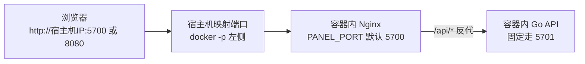

<p align="center">
  
</p>

<h1 align="center">呆呆面板</h1>

<p align="center">
  <em>轻量、现代的定时任务管理面板，Docker 一键部署，开箱即用</em>
</p>

<p align="center">
  
  
  
  
  
</p>

---

呆呆面板 (Daidai Panel) 是一款轻量级定时任务管理平台，采用 Go (Gin) + Vue3 (Element Plus) + SQLite 架构，专注于脚本托管与自动化任务调度。支持 Python、Node.js、Shell 等多语言脚本的定时执行与可视化管理，内置 18 种消息推送渠道、订阅管理、环境变量、依赖管理、Open API 等功能。Docker 一键部署，开箱即用。

## 功能特性

- **定时任务** — Cron 表达式调度，支持重试、超时、任务依赖、前后置钩子
- **脚本管理** — 在线代码编辑器，支持 Python、Node.js、Shell、TypeScript，拖拽移动文件
- **执行日志** — SSE 实时日志流，历史日志查看与自动清理
- **环境变量** — 分组管理、拖拽排序、批量导入导出（兼容青龙格式）
- **订阅管理** — 自动从 Git 仓库拉取脚本，支持定期同步
- **依赖管理** — 可视化安装/卸载 Python (pip) 和 Node.js (npm) 依赖
- **通知推送** — Bark、Telegram、Server酱、企业微信、钉钉、飞书等 18 种渠道
- **开放 API** — App Key / App Secret 认证，支持第三方系统对接
- **系统安全** — 双因素认证 (2FA)、IP 白名单、登录日志、会话管理
- **数据备份** — 一键备份与恢复，导出全部数据
- **系统监控** — 实时 CPU / 内存 / 磁盘监控，任务执行趋势统计

<details>
<summary><b>点击展开查看详细功能</b></summary>

### 定时任务管理
- 标准 Cron 表达式调度
- 常用时间规则快捷选择
- 任务启用/禁用状态切换
- 手动触发执行
- 任务超时控制与重试机制
- 前后置钩子（任务依赖链）
- 多实例并发控制

### 脚本文件管理
- 在线代码编辑器（语法高亮）
- 支持创建、重命名、删除文件
- 支持文件上传与拖拽移动
- 脚本版本管理
- 调试运行与实时日志输出

### 执行日志
- SSE 实时日志流
- 执行状态追踪（成功/失败/超时/手动终止）
- 执行耗时统计
- 日志自动清理策略

### 环境变量
- 安全存储敏感配置
- 变量值脱敏显示
- 分组管理与拖拽排序
- 批量导入导出（兼容青龙格式）
- 任务执行时自动注入

### 订阅管理
- Git 仓库自动拉取
- 定期同步（Cron 调度）
- SSH Key / Token 认证
- 白名单/黑名单过滤

### 消息推送
- 18 种主流推送渠道
- 任务执行结果通知
- 系统事件告警
- 自定义推送模板

### 系统设置
- 双因素认证 (2FA / TOTP)
- IP 白名单
- 登录日志与会话管理
- 数据备份与恢复
- 面板标题与图标自定义

</details>

## 效果图

<details>
<summary><b>点击展开查看界面截图</b></summary>

| 功能 | 截图 |
|------|------|
| 登录页面 |  |
| 仪表盘 |  |
| 定时任务 |  |
| 脚本管理 |  |
| 环境变量 |  |
| 订阅管理 |  |
| 消息通知 |  |
| 依赖管理 |  |
| API 文档 |  |

</details>

## 快速部署

### 端口关系先看这个

Docker 部署时，面板涉及 **3 个端口层级**。大多数部署问题，都是把这 3 个端口混在一起造成的。

| 层级 | 作用 | 默认值 | 你通常要不要改 |
|------|------|--------|----------------|
| 宿主机端口 | 浏览器实际访问的端口，由 `-p` 左侧决定 | `5700` | 常改 |
| 容器内 Nginx 端口 | 容器内前端入口，负责静态文件和 `/api` 反代，由 `PANEL_PORT` 决定 | `5700` | 一般不改 |
| 容器内 Go 后端端口 | 容器内 API 服务端口，Nginx 反代到这里 | `5701` | 一般不要改 |



可以直接记住两条规则：

1. Docker 部署时，**通常只改 `-p` 左侧宿主机端口**，不要碰容器内后端 `5701`。
2. 宿主机上的反向代理（如宝塔/Nginx/Caddy）应当代理到 **宿主机映射端口**，不要直接代理到容器内 `5701`。

### Docker Compose（推荐）

```yaml
services:
  daidai-panel:
    image: linzixuanzz/daidai-panel:latest
    container_name: daidai-panel
    restart: unless-stopped
    ports:
      - "5700:5700" # 宿主机端口:容器内 Nginx 端口
    volumes:
      - ./Dumb-Panel:/app/Dumb-Panel # 面板数据目录
      - /var/run/docker.sock:/var/run/docker.sock  
    environment:
      - TZ=Asia/Shanghai
      - CONTAINER_NAME=daidai-panel
      - IMAGE_NAME=linzixuanzz/daidai-panel:latest
```

```bash
docker compose up -d
```

启动后访问：`http://localhost:5700`

如果你希望通过 `8080` 访问，只需要把上面的端口映射改成：

```yaml
ports:
  - "8080:5700"
```

也就是：**只改左侧宿主机端口，右侧容器内 Nginx 端口仍保持 `5700`。**

### Debian 运行时镜像

如果你需要在面板内安装 **仅 Debian / Ubuntu 提供、Alpine 无法安装** 的 Linux 软件包，可以直接使用仓库内提供的 Debian 运行时版本。

这个版本的区别是：

- 面板容器运行在 Debian 系基础镜像上
- 依赖管理里的 Linux 包安装会识别为 `apt`
- 更适合 `apk` 仓库里缺失、但 `apt` 可以直接安装的软件包

直接使用仓库内示例：

```bash
docker compose -f docker-compose.debian.yml up -d
```

启动后访问：`http://localhost:5700`

如果你是基于当前源码本地试跑，也可以手动构建：

```bash
docker build --build-arg VERSION=1.9.1 -f Dockerfile.debian -t daidai-panel:debian-local .
```

从 `v1.9.0` 开始，仓库里的发布工作流会自动发布 Debian 运行时镜像。Debian 运行时只保留一个滚动标签：

- `linzixuanzz/daidai-panel:debian`

发布完成后，可以按下面方式直接拉取：

```bash
docker pull linzixuanzz/daidai-panel:debian
```

> **说明**：默认 `docker-compose.yml` 和 Docker Hub `latest` / `<版本号>` 仍是 Alpine 运行时；只有使用 `Dockerfile.debian`、`docker-compose.debian.yml`，或者 Docker Hub 上的 `debian` tag 时，容器内 Linux 依赖安装才会切换到 Debian / `apt` 链路。

### Docker Run

```bash
docker run -d \
  --pull=always \
  --name daidai-panel \
  --restart unless-stopped \
  -p 5700:5700 \
  -v $(pwd)/Dumb-Panel:/app/Dumb-Panel \
  -v /var/run/docker.sock:/var/run/docker.sock \
  -e TZ=Asia/Shanghai \
  -e CONTAINER_NAME=daidai-panel \
  -e IMAGE_NAME=linzixuanzz/daidai-panel:latest \
  linzixuanzz/daidai-panel:latest
```

启动后访问：`http://localhost:5700`

首次使用需要初始化管理员账号。

> **说明**：挂载 `/var/run/docker.sock` 是为了支持面板内一键更新功能。如果不需要此功能，可以移除该挂载。

> **说明**：`-p 5700:5700` 的左侧是宿主机端口，右侧是容器内 Nginx 端口，不是 Go 后端端口。

### 本地开发运行

#### 环境要求

- Go 1.25+
- Node.js 20.19+（20.x LTS）或 22.12+
- npm 或 pnpm

#### 启动后端

```bash
cd server
go run .
```

后端默认监听 `5701` 端口，读取同目录下的 `config.yaml` 作为配置文件。

#### 启动前端

```bash
cd web
npm install
npm run dev
```

前端 Vite 开发服务器默认运行在 `5173` 端口，已配置将 `/api` 请求代理到 `http://localhost:5701`。

启动后访问：`http://localhost:5173`

#### 本地端口修改

**修改后端端口**：编辑 `server/config.yaml`

```yaml
server:
  port: 5701    # 改为你想要的端口
```

修改后端端口后，需要同步修改前端代理地址。编辑 `web/vite.config.ts`：

```typescript
server: {
  port: 5173,   // 前端端口，按需修改
  proxy: {
    '/api': {
      target: 'http://localhost:5701',  // 改为对应的后端端口
      changeOrigin: true
    }
  }
}
```

#### 构建生产版本

```bash
# 构建前端
cd web
npm run build

# 构建后端
cd server
go build -o daidai-panel .
```

前端构建产物在 `web/dist/`，需配合 Nginx 或其他静态服务器部署，并反向代理 `/api` 到后端。

### 自定义端口（Docker）

#### 场景 1：只修改宿主机访问端口（推荐）

这是最常见的需求。容器内端口保持默认值即可，只改 `-p` 左侧：

```bash
# 浏览器访问 http://宿主机IP:8080
docker run -d \
  --pull=always \
  --name daidai-panel \
  --restart unless-stopped \
  -p 8080:5700 \
  -v $(pwd)/Dumb-Panel:/app/Dumb-Panel \
  -v /var/run/docker.sock:/var/run/docker.sock \
  -e TZ=Asia/Shanghai \
  linzixuanzz/daidai-panel:latest
```

此时端口关系是：

- 宿主机访问端口：`8080`
- 容器内 Nginx 端口：`5700`
- 容器内 Go 后端端口：`5701`

#### 场景 2：同时修改容器内 Nginx 端口（一般不需要）

只有在你明确需要调整容器内 Nginx 监听端口时，才设置 `PANEL_PORT`，并保持 `-p` 右侧与其一致：

```bash
# 浏览器访问 http://宿主机IP:8080
# 容器内 Nginx 监听 7100
docker run -d \
  --pull=always \
  --name daidai-panel \
  --restart unless-stopped \
  -p 8080:7100 \
  -e PANEL_PORT=7100 \
  -v $(pwd)/Dumb-Panel:/app/Dumb-Panel \
  -v /var/run/docker.sock:/var/run/docker.sock \
  -e TZ=Asia/Shanghai \
  linzixuanzz/daidai-panel:latest
```

此时端口关系是：

- 宿主机访问端口：`8080`
- 容器内 Nginx 端口：`7100`
- 容器内 Go 后端端口：`5701`

> **注意**：`-p` 右侧的容器端口必须与 `PANEL_PORT` 一致，否则宿主机流量进不到容器内 Nginx。
> **注意**：`PANEL_PORT` 只影响容器内 Nginx 端口，不影响容器内 Go 后端 `5701`。

## 多架构支持

镜像同时支持 `linux/amd64` 和 `linux/arm64`，可在 x86 服务器和 ARM 设备（如树莓派、Oracle ARM 云服务器）上直接运行。

## 自动发布

仓库已配置 GitHub Actions 发布工作流。推送形如 `v1.9.1` 的 tag 后，会自动完成：

- 创建 GitHub Release
- 推送 Alpine 运行时镜像：`linzixuanzz/daidai-panel:latest`
- 推送 Alpine 版本镜像：`linzixuanzz/daidai-panel:1.9.1`
- 推送 Debian 运行时镜像：`linzixuanzz/daidai-panel:debian`

本次版本发布命令示例：

```bash
git tag v1.9.1
git push origin v1.9.1
```

## 更新方法

### 方式一：面板内一键更新（推荐）

进入「系统设置」→「概览」，点击「检查系统更新」，如有新版本会提示一键更新。

### 方式二：手动更新

```bash
docker pull linzixuanzz/daidai-panel:latest
docker compose up -d
```

如果你当前使用的是源码仓库里手动本地构建的 Debian 运行时镜像，更新方式是重新构建：

```bash
docker build --build-arg VERSION=1.9.1 -f Dockerfile.debian -t daidai-panel:debian-local .
```

如果你使用的是 Debian 运行时镜像，则按下面方式更新：

```bash
docker pull linzixuanzz/daidai-panel:debian
docker compose -f docker-compose.debian.yml up -d
```

## 数据目录

```
./Dumb-Panel/
├── daidai.db          # SQLite 数据库
├── .jwt_secret        # 自动生成的 JWT 密钥
├── panel.log          # 面板运行日志
├── deps/              # Python / Node.js 依赖目录
├── scripts/           # 脚本文件存储
├── logs/              # 执行日志
└── backups/           # 数据备份
```

## 技术栈

| 层 | 技术 |
|----|------|
| 前端 | Vue 3 + TypeScript + Element Plus + Pinia + Vite |
| 后端 | Go (Gin) + GORM + SQLite |
| 部署 | Nginx + Go Binary，Docker 单镜像（AMD64 / ARM64） |

## 环境变量

| 变量 | 说明 | 默认值 |
|------|------|--------|
| `TZ` | 时区 | `Asia/Shanghai` |
| `DATA_DIR` | 数据存储目录 | `/app/Dumb-Panel` |
| `DB_PATH` | 数据库路径 | `${DATA_DIR}/daidai.db` |
| `PANEL_PORT` | 容器内 Nginx 监听端口 | `5700` |
| `SERVER_PORT` | Go 服务端口 | `5701` |

> **建议**：Docker 部署时通常只改宿主机端口映射，不改 `SERVER_PORT`。  
> `SERVER_PORT` 是容器内后端端口；若你强行修改它，还需要确保容器内反向代理配置同步指向新的后端端口。

<details>
<summary><b>config.yaml 完整配置说明</b></summary>

本地开发时后端读取 `server/config.yaml`，Docker 部署时由 `entrypoint.sh` 自动生成。

```yaml
server:
  port: 5701          # 后端 API 端口
  mode: release       # debug / release

database:
  path: ./data/daidai.db    # SQLite 数据库路径

jwt:
  secret: ""                # 留空则自动生成并持久化
  access_token_expire: 480h
  refresh_token_expire: 1440h

data:
  dir: ./data               # 数据根目录
  scripts_dir: ./data/scripts
  log_dir: ./data/logs

cors:
  origins:                  # 允许的跨域来源
    - http://localhost:5173
    - http://localhost:5700
```

</details>

## 配置分层说明

如果你准备做运维或二次集成，建议先区分下面两类配置：

- 启动配置：Docker 环境变量、`config.yaml`
- 运行期系统配置：设置页“系统设置”里保存到数据库 `system_configs` 的配置项

运行期系统配置当前已经有统一注册表和运维说明，包含默认值、类型、何时生效、注意事项：

- [系统配置与运维说明](./docs/system-config-operations.md)

如果你通过 API 做自动化管理，也可以直接读取 `/api/v1/configs`，当前接口会返回：

- `value`
- `default_value`
- `value_type`
- `group`
- `options`
- `registered`

## 反向代理说明

### 场景 A：宿主机 Nginx 代理到 Docker 已发布端口

这是最常见的部署方式：

1. 呆呆面板容器通过 `-p 8080:5700` 暴露在宿主机 `8080`
2. 宿主机上的 Nginx / 宝塔 / Caddy 再反代到 `127.0.0.1:8080`

这时你的反向代理目标应该是 **宿主机端口 `8080`**，不是容器内后端 `5701`。

<details>
<summary><b>宿主机 Nginx 反向代理示例（HTTPS）</b></summary>

```nginx
map $http_upgrade $connection_upgrade {
    default upgrade;
    '' close;
}

server {
    listen 443 ssl http2;
    server_name your-domain.com;

    ssl_certificate     /path/to/fullchain.pem;
    ssl_certificate_key /path/to/privkey.pem;

    location / {
        proxy_pass http://127.0.0.1:5700;
        proxy_set_header Host $host;
        proxy_set_header X-Real-IP $remote_addr;
        proxy_set_header X-Forwarded-For $proxy_add_x_forwarded_for;
        proxy_set_header X-Forwarded-Proto https;

        proxy_http_version 1.1;
        proxy_set_header Upgrade $http_upgrade;
        proxy_set_header Connection $connection_upgrade;

        proxy_buffering off;
        proxy_read_timeout 300s;
    }
}
```

</details>

如果你 Docker 用的是 `-p 8080:5700`，那就把上面的 `proxy_pass` 改成：

```nginx
proxy_pass http://127.0.0.1:8080;
```

### 场景 B：同一 Docker 网络中的反向代理容器

如果你的反向代理本身也运行在 Docker 里，并且和呆呆面板在同一个 Docker 网络中，那么它可以直接代理到：

- `http://daidai-panel:5700`

这里的 `5700` 仍然是 **容器内 Nginx 端口**，不是 Go 后端 `5701`。

### 不建议的做法

- 不要让浏览器或宿主机反向代理直接访问容器内 Go 后端 `5701`
- 不要把 SSE、下载、鉴权接口单独绕过容器内 Nginx
- 不要把 `-p` 右侧容器端口和 `PANEL_PORT` 配成不一致

## 致谢

本项目的开发离不开以下优秀的开源项目：

- **[白虎面板 (Baihu Panel)](https://github.com/engigu/baihu-panel)** — 后端框架架构参考，部分代码基于白虎面板改进
- **[青龙面板 (Qinglong)](https://github.com/whyour/qinglong)** — 功能设计参考，定时任务管理、环境变量、订阅管理等核心功能借鉴自青龙面板

感谢以上项目作者的贡献！

## LICENSE

Copyright © 2026, [linzixuanzz](https://github.com/linzixuanzz). Released under the [MIT](LICENSE).
